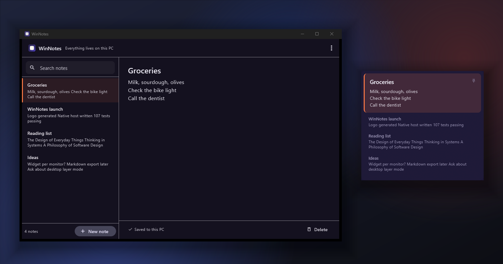
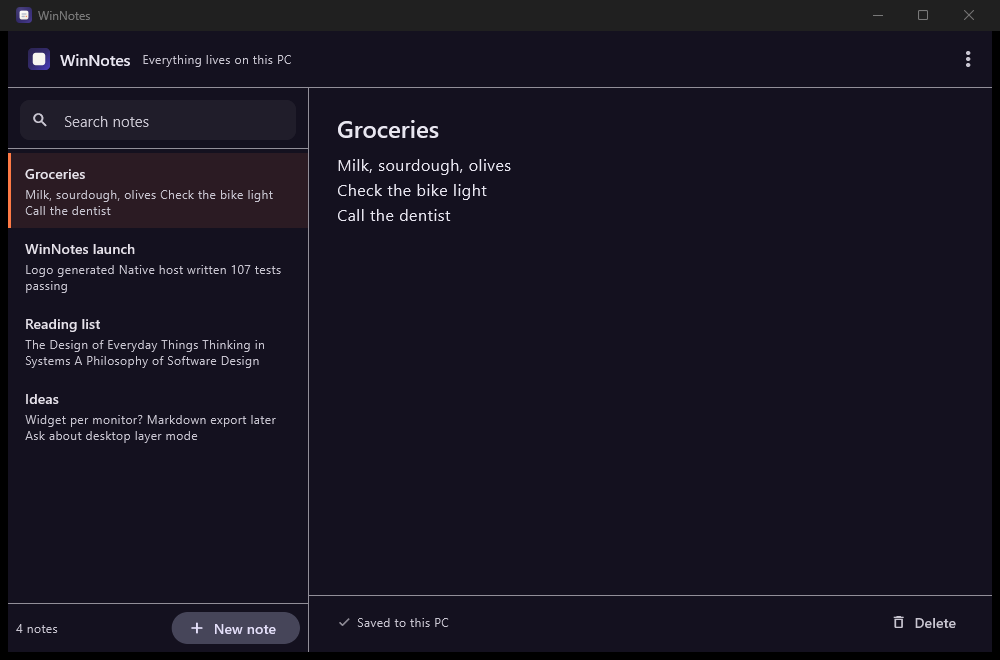
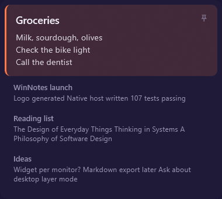

<p align="center">
  
</p>

<p align="center">
  Desktop notes that stay on the screen and come back by themselves.<br>
  Windows 11 Pro. Nothing leaves this PC.
</p>

<p align="center">
  
</p>

---

WinNotes is a notes widget for Windows 11. It fills the one gap between
Microsoft Sticky Notes and an Android widget: Sticky Notes is a good app trapped
inside an ordinary window, so it gets covered, gets closed, and never returns on
its own. On a phone, notes live on the home screen and survive everything.
WinNotes is that idea, built for Windows.

There is no account, no sign-up, no server, no cloud and no sync. Every note is
one plain-text file in your own profile folder.

## Download and install

Grab the latest release from
**[the Releases page](https://github.com/OttomanDeveloper/notewidget-windows/releases)**.
Every release has two downloads:

| Download | What it is |
| --- | --- |
| `WinNotes-<version>-windows-x64.zip` | Portable. Unzip anywhere and run `win_notes.exe`. No installer, no registry entries, nothing to clean up. |
| `WinNotes-<version>-setup.exe` | Installs per-user into `%LOCALAPPDATA%\Programs\WinNotes`, adds a Start menu entry, and optionally a startup entry and desktop shortcut. |

The installer asks for **no administrator rights**, because the app never needs
any: its notes live in your own profile folder and its startup entry is under
your own account.

Both are **not code-signed**, so Windows SmartScreen will show
*"Windows protected your PC"* on first run. Choose **More info → Run anyway**.
This is the normal consequence of an unsigned open-source build; it is not a
virus warning specific to this project. If you would rather not click through
it, build it yourself from the source below.

### Uninstalling

Use the uninstaller in the Start menu group, or uninstall from
**Settings → Apps**. It removes the program and the startup entry.

**Your notes are never deleted.** They live in `%APPDATA%\WinNotes` and belong to
you, not to the installation. Delete that folder yourself if you want them gone.

### Upgrading

Install the new version over the old one. Your notes and settings are untouched,
because they are in `%APPDATA%` and not in the program folder.

## Build it from source

Clone it:

```
git clone https://github.com/OttomanDeveloper/notewidget-windows.git
cd notewidget-windows
flutter pub get
```

You need two things installed:

| Requirement | Notes |
| --- | --- |
| [Flutter SDK](https://docs.flutter.dev/get-started/install/windows) (stable) | The project targets Dart `^3.13.4`. Developed against Flutter 3.47. |
| [Visual Studio 2022](https://visualstudio.microsoft.com/downloads/) | The **Desktop development with C++** workload. The runner is native C++, so Flutter's Windows build will not work without it. |

Check both are visible to Flutter:

```
flutter doctor -v
```

You want `Flutter` and `Visual Studio - develop Windows apps` to both be green.
`flutter doctor` is the command that actually fails the build; if it complains
about the Visual Studio workload, the C++ bits of the toolchain are missing.

Then:

```
flutter build windows --release
```

The result is a single folder:

```
build/windows/x64/runner/Release/
```

There is no installer and no install step. Copy that folder anywhere on the
machine and it runs. It needs the whole folder, not just `win_notes.exe` -
alongside it are the Flutter engine DLLs and the `data/` directory. The window
and tray icons are compiled into the executable as resources, so there are no
loose image files to go missing.

Run the tests with:

```
flutter test
```

## Run it from source

```
flutter run -d windows
```

Both windows appear: the widget on your desktop, the editor as a normal window.
Press `Ctrl+Alt+N` from any application to bring the editor up without touching
the tray.

## Two surfaces

**The widget** is a frameless window that sits on the desktop, above ordinary
windows, with no title bar and no taskbar button. Clicking it never steals the
caret from whatever you are typing in. It survives every restart.

**The editor** is an ordinary window with an ordinary title bar, because it is
the one surface you are deliberately looking at. You ask for it; it never appears
on its own at boot.

Neither is more real than the other. They are two views of the same notes.

<details>
<summary>Screenshots of each surface on its own</summary>

<p align="center">
  
</p>

<p align="center">
  
</p>

</details>

Both images are real captures of the app with sample notes, taken with
`PrintWindow` rather than a screen grab so that nothing from the desktop behind
them can leak in. Regenerate them with:

```
pwsh -File tool/screenshots/capture.ps1 -OutDir docs/images
pwsh -File tool/screenshots/compose_hero.ps1 -Editor docs/images/editor.png -Widget docs/images/widget.png -OutPath docs/images/hero.png
```

## What it does

- **Notes** are a title and a body. Nothing else, ever. They sort by most
  recently edited and search covers titles and bodies, filtering as you type.
- **Writing is immediate.** There is no save button. Changes are written as they
  are typed, debounced by a fraction of a second so a burst of keystrokes costs
  one write rather than one per character. A burst that never pauses still lands
  within 1.5 seconds, so continuous typing cannot outrun the disk forever.
- **A note can be marked done**, from the widget or the editor, and the line
  through the text is the whole signal. There is a circle on every card in the
  widget, on every row in the editor's list, and beside the title you are
  editing; `Ctrl+D` does the same from the keyboard. Pressing it in the list does
  not also open the note, because working through a list means pressing the same
  small circle a dozen times in a row. Marking a note done deliberately does not
  count as editing it, so the list does not jump around as you tick things off —
  and the widget's large card moves on to the next unfinished note, rather than
  leaving a line through the thing you look at most.
- **A failed write never costs you a note.** Replacing a file on Windows fails
  outright if antivirus, Search Indexer or a backup tool happens to hold it open.
  WinNotes retries with backoff and keeps the value queued. It never mistakes a
  busy disk for unreadable notes.
- **The widget comes back by itself** after every restart, via one entry under
  the per-user `Run` key. No administrator rights, and it shows up in Task
  Manager → Startup like any other app.
- **`Ctrl+Alt+N`** opens the editor from any application, full-screen ones
  included. Changeable in Settings, and a collision with another app's shortcut
  is reported rather than silently ignored.
- **The tray icon is the app's home.** Show or hide the widget, open the editor,
  quit. Quit is the only thing that ends the app, and it asks first.
- **Acrylic backdrop**, so the widget picks up the wallpaper the way native
  Windows 11 surfaces do, falling back to a plain translucent surface where
  Windows cannot provide it.
- **Per-monitor position.** The widget returns to the screen you left it on. If
  that monitor is unplugged, it comes back on the nearest remaining one instead
  of somewhere it can never be clicked again.
- **Add a note without leaving what you were doing.** A small circle in the
  widget's bottom-right corner — nearly invisible until you move the pointer over
  it — becomes a text field in the same spot. Type, press Enter, done. Escape
  throws it away. One line becomes the note's title and the rest its body, so it
  looks like a note you wrote in the editor.
- **Drag the widget anywhere.** Grab it and move it; it comes back where you left
  it, on whichever monitor that was. If you would rather pin it, Settings has a
  lock — and a locked widget says so when you try to drag it, rather than
  silently doing nothing.
- **Plain-text export and import.** The format is deliberately boring, so a
  backup taken years from now is still readable without this app.

## Widget settings

Two switches, together in Settings → **Widget**, because they are the same
decision seen from two sides: whether the widget stays out of your way, and
whether it stays where you put it. Settings opens from the tray icon, or from
the editor's menu.

| Setting | Default | What it does |
| --- | --- | --- |
| **Keep the widget above other windows** | On | The widget stays on top of ordinary windows. Turn it off and it behaves like a normal window, so it can be covered. |
| **Lock the widget in place** | Off | Dragging does nothing, so the widget stays exactly where you put it. If you drag a locked widget it tells you it is locked and where to change that, rather than ignoring you. Resizing from a corner still works either way. |

Dragging works out of the box. The lock is there for when you have parked the
widget somewhere deliberate and would rather it stayed.

This started out the other way round — locked by default — and was reverted. Not
being able to move the widget at all turned out to be a much bigger annoyance
than the occasional accidental drag it prevented, and the only way out was a
switch in Settings that nobody would think to look for.

Both take effect the moment you flip them. The widget watches `settings.json`,
so a change made here reaches the window without a restart.

## Where the notes live

`%APPDATA%\WinNotes\`

| File | Written by | Purpose |
| --- | --- | --- |
| `notes.json` | the editor, or the widget when there is no editor | Every note. The only file that matters. |
| `notes.json.bak` | the editor | The previous good version, kept automatically. |
| `settings.json` | the editor | Appearance, startup, hotkey, storage location. |
| `widget_state.json` | the widget | Where the widget was left, and on which monitor. |
| `selection.json` | either | Which note is focused. |

One writer per file. That is the whole concurrency story: there is no merge
logic anywhere in this project, because there is never a moment when two
surfaces write the same file.

The one row worth reading twice is `notes.json`. Marking a note done from the
widget is a real edit, so the widget asks the runner whether an editor window
exists. If it does, the request is routed to the editor, which owns the file and
makes the change the way it makes any other. If it does not — an autostart launch,
where the editor has never been opened — then there is no other writer and
nothing buffered to lose, so the widget writes it itself. The decision comes from
the runner's own view of the world rather than from a cached guess, so the two
branches cannot both write.

### When something goes wrong with the file

**If `notes.json` cannot be read, WinNotes stops rather than starting with an
empty list**, because notes that were never read are worse than notes that take a
moment longer to open. Every write is blocked while that is true, so nothing can
overwrite a file the app has not managed to read.

It is not stuck, though. The screen offers whatever is worth trying, in order:

| What you see | What it means | What to press |
| --- | --- | --- |
| *Something is holding your notes file* | Antivirus, a backup tool or a sync client has it open. Your notes are almost certainly fine. | **Try again** — it opens the moment the file is let go. |
| *Your notes file could not be read* | The content is wrong. Writes are atomic, so WinNotes cannot have caused it. | **Restore the previous version** — `notes.json.bak`, which this app wrote itself. Failing that, a plain-text backup of your own, or **Start fresh instead**. |

**Start fresh** never deletes anything. The unreadable file is renamed to
`notes.json.broken-<timestamp>` in the same folder, and a new empty one is
created beside it, so the damaged content is still there if you want it — or want
to send it to someone who can read JSON.

A file that has been **deleted** — quarantined by antivirus, say — is not a
problem at all. A missing file is a first run, and WinNotes opens with an empty
note ready to type into.

`notes.json` is written whole, via a temporary file and an atomic replace, so a
kill mid-sentence cannot leave it half-written.

Reading these, and copying them somewhere safe, works while the app is running -
nothing here holds a lock, which is a deliberate choice rather than an accident.
Hand-editing is where it gets sharp: `notes.json` belongs to the editor, so an
edit you make in Notepad while the editor is open will be overwritten the next
time you type. Close the editor first, or use the in-app plain-text export.

## The logo

Deep indigo plate, off-white note card, a coral caret. The caret is the accent
because it is the part of the mark that means *being written right now*.

| File | Use |
| --- | --- |
| `assets/brand/winnotes_mark.svg` | Primary mark. 1024 master grid. |
| `assets/brand/winnotes_mark_small.svg` | Small-size mark, for 16-32px. |
| `assets/brand/winnotes_tray_light.ico` | Tray, light taskbar. |
| `assets/brand/winnotes_tray_dark.ico` | Tray, dark taskbar. |
| `assets/brand/winnotes_wordmark*.svg` | Lockups, light and dark surfaces. |
| `assets/brand/winnotes.ico` | App icon, 256 down to 16. |

Regenerate every derived file from the SVG masters:

```
pwsh -File tool/brand/generate_assets.ps1
```

The script rasterises with headless Chrome and packs the `.ico` files itself.
It also **verifies every icon frame** by re-reading each embedded PNG's IHDR
header and comparing its real dimensions against the directory entry, because a
malformed entry produces a file that looks fine and renders as garbage at one
specific size.

Two details worth knowing if you edit the artwork:

- **Small sizes are redrawn, not scaled.** `winnotes_mark_small.svg` is a
  separately drawn, much heavier mark. The full-detail master turns to mush
  below 32px.
- **Both wordmarks ship.** The near-white-on-dark lockup is invisible on a white
  page, so a light-surface variant exists for docs.

## Layout

```
lib/
  main.dart                  entry for both surfaces
  src/
    core/                    paths, atomic JSON file with debounce and watch
    data/                    note model, repositories, backup format
    platform/                typed wrapper over the runner's method channel
    state/                   notes, settings and widget controllers
    ui/
      editor/                the editor window
      widget/                the widget window
      settings/              the settings dialog
      common/                confirm dialog, undo toast, done toggle, empty states
windows/runner/              native host: windows, tray, hotkey, autostart
installer/winnotes.iss       setup.exe definition
assets/brand/                logo sources and derived assets
docs/                        pattern docs: storage, widget, testing
docs/images/                 README screenshots
AGENTS.md                    working agreement: rules, docs index, known bugs
tool/brand/                  logo generator
tool/release/                packaging: builds, verifies, zips, compiles setup.exe
tool/screenshots/            screenshot capture, hero composition, input probe
.github/workflows/           CI on every push, release on a version tag
test/                        164 tests
```

### How the two windows work

Each surface is a separate top-level Win32 window with its own Flutter engine and
its own Dart isolate. Both call the same `main()`; a `--surface` argument decides
which one is running.

They do not talk to each other directly. They share files: the editor writes
`notes.json`, the widget watches it and re-reads on change. That is why there is
no cross-isolate merge code, and why it is impossible for the two to disagree
about a note.

The watcher watches the *directory*, not the file. On Windows a file watcher
holds a handle open on the file itself, which would block the other isolate's
atomic rename, block your backup tool, and stop you copying your own notes out
by hand.

The native layer owns everything Windows-shaped: the frameless layered widget
window, the acrylic backdrop, the tray icon, the global hotkey, the registry
entry, and single-instance behaviour. `window_manager`-style plugins were not
used, so the behaviours above are implemented directly against Win32 and can be
tested by reading the code rather than by trusting a dependency.

The position lock is one of them, and so is dragging the widget at all.

The obvious way to make a frameless window draggable is to answer `HTCAPTION`
for its body and let Windows run the move loop. That cannot work here, for two
independent reasons. The Flutter view covers the client area, so the system
hit-tests the child and never asks the widget what it thinks. And even when it
does ask, `DefWindowProc` only starts a move or size loop for a window with
`WS_CAPTION` or `WS_THICKFRAME`, which a borderless `WS_POPUP` has neither of.
Claiming `HTCAPTION` over the body would also be wrong on its own terms: the same
pixels have to deliver taps, because the cards are selectable and a double-click
opens the editor, and Windows delivers a message to exactly one target per pixel.

So the widget is `HTCLIENT` throughout. Dart decides what a gesture is — and has
to, since it is the only side that can tell a scroll from a drag, and the only
side the position lock lives on — and then hands it to the runner, which tracks
the cursor itself. That last part is not optional: Flutter reports pointer
positions relative to the view, so a window that follows the cursor shrinks its
own delta, and computing the drag in Dart lands the widget at a little over 40%
of the distance asked for. The screen-space cursor only exists in the runner.

The runner also has to be handed the gesture's *anchor*, not just told that a
drag started. It is told only after the pointer has already travelled past the
threshold, so anchoring on the cursor at that moment quietly discards everything
moved in the first hop.

Typing in the widget runs into the mirror image of that, and is worth reading
about because the constraint is counter-intuitive. The widget is
`WS_EX_NOACTIVATE` so clicking it never pulls the caret out of whatever you are
typing into — which is also, and not incidentally, why it could never contain a
text field. The composer drops the flag while it is open and puts it straight
back when it closes, remembering which window had the keyboard and handing it
back there. `WM_MOUSEACTIVATE` refuses activation as well, and had to stop
doing so too, which is the same problem one layer down. Nothing here is permanent
because nothing permanent would be acceptable: a widget that could hold the caret
would be the most irritating thing on the desktop, and one that could not take
it could not be typed into.

## Tests

```
flutter test
```

164 tests covering the parts where being wrong loses data: atomic writes and
concurrent readers, the refusal to overwrite unreadable notes, retrying a write
the filesystem would not accept, undo ordering, search, the plain-text backup
format including bodies that contain a divider, settings validation and
clamping, and the widget's card rendering.

Two of them exist because of bugs that only a person using the app would have
found. A widget that claims to be draggable but cannot be is not something a test
asserts unless somebody asks what "draggable" means: the tests here check that a
drag is handed to the runner with the right anchor, that a scroll wins over a
drag while the list has more to read and the window wins once it does not, that
the lock stops the hand-off, and that an edge grab is a resize. And the Settings
test drives the real overflow menu, because the bug there was a `BuildContext`
sitting above the `MaterialApp`'s Navigator — nothing about the code looked
wrong, and the symptom was silence.

A third needed `CreateFileW` called directly. `dart:io` opens files with
`FILE_SHARE_READ | FILE_SHARE_WRITE`, so a handle taken from Dart never blocks a
reader, which means the "antivirus is looking at your file" bug could not be
reproduced from Dart at all — it needed a real exclusive lock, and it had already
shipped by the time anyone noticed.

## Deliberately not built

No accounts, no sync, no Markdown, no folders, no tags, no reminders, no due
dates, no encryption, no network code of any kind.

`PROJECT.md` is the design document, including a section on things that were
considered and left out, and why.

## Reporting a bug

Use the **Report a bug** button on the
[issues page](https://github.com/OttomanDeveloper/notewidget-windows/issues).
The form asks for the version and what you were doing, which is nearly always
what is needed to reproduce a problem.

Two things worth knowing before you file one:

- **Try a fresh profile first.** Close WinNotes, rename `%APPDATA%\WinNotes` to
  `WinNotes.old`, and launch again. That single step tells us whether it is a
  data problem or a code problem, and it is the most useful thing you can do
  before reporting.
- **`notes.json` is worth pasting** once you have removed anything you would not
  want published. It is plain JSON, it reproduces the exact state the app was
  in, and issues are public the moment you submit.

**[ISSUE_REPORTING.md](ISSUE_REPORTING.md)** covers all of it in detail, including
what to leave out of a screenshot and how to report a security problem privately
instead of in public.

## Contributing

Patches are welcome — see [CONTRIBUTING.md](CONTRIBUTING.md) for the build
setup, the two design rules most mistakes break (one writer per file, and the
surfaces never talking directly), and how releases are cut.

Before changing anything, read **[AGENTS.md](AGENTS.md)**. It is a page long, and
it points at the three docs worth your time:
[storage](docs/storage_pattern.md) (one writer per file, atomic replace, recovery
that never destroys), [widget](docs/widget_pattern.md) (why the widget hit-tests
as `HTCLIENT` everywhere, and how it borrows the keyboard), and
[testing](docs/testing_pattern.md) (what the suite is allowed to claim, and the
traps that have already cost time). Each ends with a table naming the tests that
pin its rules.

## Licence

MIT. See [LICENSE](LICENSE).