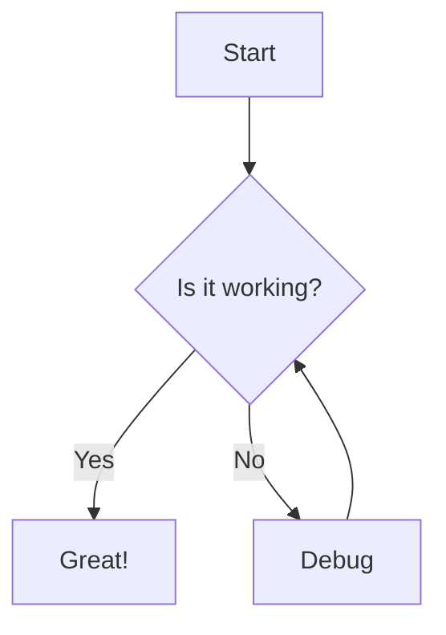
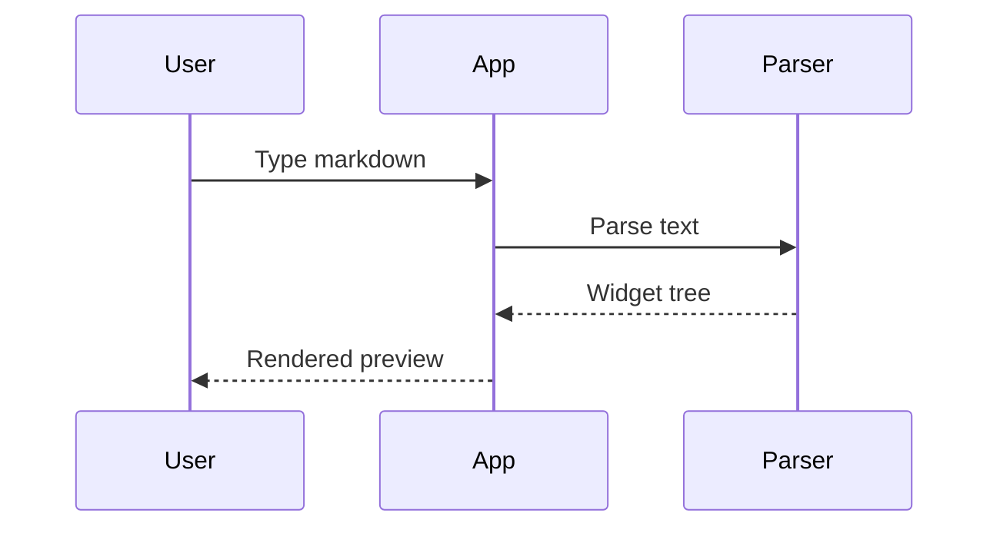

# 📝 Markdown Renderer Test File

This file exercises **every common Markdown feature** so you can check your Flutter renderer.

Feature tags used in this file:

- **(core)** is standard Markdown (CommonMark). Every renderer should support it.
- **(GFM)** is GitHub Flavored Markdown: tables, task lists, strikethrough, autolinks.
- **(extension)** is not supported by default in most Flutter packages, and may need extra setup.

---

## Table of Contents

1. [Headings](#1-headings)
2. [Text Formatting](#2-text-formatting)
3. [Paragraphs & Line Breaks](#3-paragraphs--line-breaks)
4. [Lists](#4-lists)
5. [Checkboxes (Task Lists)](#5-checkboxes-task-lists)
6. [Blockquotes](#6-blockquotes)
7. [Tables](#7-tables)
8. [Code](#8-code)
9. [Folder Structure](#9-folder-structure)
10. [Command Samples](#10-command-samples)
11. [Links](#11-links)
12. [Images](#12-images)
13. [Emojis](#13-emojis)
14. [Horizontal Rules](#14-horizontal-rules)
15. [Footnotes](#15-footnotes)
16. [HTML Elements](#16-html-elements)
17. [Alerts / Callouts](#17-alerts--callouts)
18. [Math](#18-math)
19. [Diagrams](#19-diagrams)
20. [Escaping Characters](#20-escaping-characters)
21. [Unicode & Languages](#21-unicode--languages)
22. [Edge Cases & Stress Tests](#22-edge-cases--stress-tests)

---

## 1. Headings

*(core)*

# Heading 1
## Heading 2
### Heading 3
#### Heading 4
##### Heading 5
###### Heading 6

Setext Heading Level 1
======================

Setext Heading Level 2
----------------------

### Heading with **bold**, *italic*, `code` and a [link](https://flutter.dev)

####### Seven hashes (should render as plain text, not a heading)

---

## 2. Text Formatting

*(core unless noted)*

| Style | Source | Result |
|-------|--------|--------|
| Bold | `**bold**` | **bold** |
| Bold (alt) | `__bold__` | __bold__ |
| Italic | `*italic*` | *italic* |
| Italic (alt) | `_italic_` | _italic_ |
| Bold + Italic | `***both***` | ***both*** |
| Strikethrough (GFM) | `~~strike~~` | ~~strike~~ |
| Inline code | `` `code` `` | `code` |
| Highlight (extension) | `==highlight==` | ==highlight== |
| Subscript (extension) | `H~2~O` | H~2~O |
| Superscript (extension) | `X^2^` | X^2^ |

Mixed inline formatting: **bold with *nested italic* inside**, *italic with **nested bold** inside*, ~~strike with **bold**~~, and **`bold code`**.

Intra-word emphasis: un**frigging**believable, snake_case_word should not turn italic.

---

## 3. Paragraphs & Line Breaks

*(core)*

This is paragraph one. It has multiple sentences. This line is soft-wrapped
in the source but should continue on the same line when rendered.

This is paragraph two, separated by a blank line.

Line break with two trailing spaces:  
This line should appear directly below.

Line break with a backslash:\
This line should also appear directly below.

Line break with an HTML tag:<br>
This line should also appear directly below.

---

## 4. Lists

*(core)*

### 4.1 Unordered list (all three markers)

- Item with dash
- Another item
  - Nested item (level 2)
    - Nested item (level 3)
      - Nested item (level 4)
        - Nested item (level 5)

* Item with asterisk
* Another item

+ Item with plus
+ Another item

### 4.2 Ordered list

1. First
2. Second
3. Third
   1. Nested first
   2. Nested second
      1. Deep nested
4. Fourth

### 4.3 Ordered list starting at a different number

5. Starts at five
6. Then six
7. Then seven

### 4.4 Ordered list with all the same number

1. One
1. One again
1. And again

### 4.5 Mixed ordered and unordered

1. Step one
   - Detail A
   - Detail B
2. Step two
   - Detail C
     1. Sub-step
     2. Sub-step
3. Step three

### 4.6 Loose list (paragraphs inside items)

- First item with a paragraph.

  A second paragraph inside the same item.

- Second item.

  ```dart
  void main() => print('Code inside a list item');
  ```

- Third item with a quote:

  > Quoted text inside a list item.

### 4.7 Definition list *(extension)*

Flutter
: A UI toolkit for building apps from a single codebase.

Dart
: The programming language used by Flutter.

---

## 5. Checkboxes (Task Lists)

*(GFM)*

- [x] Completed task
- [ ] Pending task
- [x] Another completed task
- [ ] Task with **bold**, *italic* and `code`
- [ ] Parent task
  - [x] Completed subtask
  - [ ] Pending subtask
    - [ ] Deep subtask
- [X] Capital X should also count as checked

Numbered task list:

1. [x] Design the UI
2. [x] Write the models
3. [ ] Add markdown preview
4. [ ] Release v1.0

---

## 6. Blockquotes

*(core)*

> This is a simple blockquote.

> This is a multi-line blockquote.
> It continues on the second line.
>
> And this is a second paragraph inside the same quote.

> ### Heading inside a quote
> - List item one
> - List item two
>
> **Bold** and *italic* inside a quote, plus `inline code`.

> Level 1
>> Level 2
>>> Level 3
>>>> Level 4

> A quote with code:
>
> ```bash
> echo "Hello from inside a quote"
> ```

> "The best way to predict the future is to invent it."
>
> — **Alan Kay**

---

## 7. Tables

*(GFM)*

### 7.1 Basic table

| Name  | Role      | Age |
|-------|-----------|-----|
| Alice | Developer | 28  |
| Bob   | Designer  | 34  |
| Carol | Manager   | 41  |

### 7.2 Column alignment

| Left aligned | Center aligned | Right aligned |
|:-------------|:--------------:|--------------:|
| Left         | Center         | Right         |
| Apple        | Banana         | Cherry        |
| 1            | 22             | 333           |

### 7.3 Formatting inside cells

| Feature | Example | Status |
|---------|---------|:------:|
| **Bold** | *Italic* | ✅ |
| `inline code` | ~~strike~~ | ❌ |
| [A link](https://dart.dev) | Emoji 🚀 | ⚠️ |
| Escaped pipe | a \| b | ✅ |

### 7.4 Empty cells and uneven columns

| A | B | C |
|---|---|---|
| 1 |   | 3 |
|   | 2 |   |
| x | y |

### 7.5 Wide table (horizontal scroll test)

| ID | First Name | Last Name | Email | Phone | Country | City | Department | Position | Start Date | Salary | Notes |
|----|-----------|-----------|-------|-------|---------|------|------------|----------|------------|--------|-------|
| 1 | Aarav | Sharma | aarav@example.com | +91 98765 43210 | India | Mumbai | Engineering | Senior Developer | 2022-01-15 | 1,200,000 | Team lead for mobile |
| 2 | Emma | Johnson | emma@example.com | +1 555 0100 | USA | Seattle | Design | UI Designer | 2023-03-01 | 95,000 | Works on design system |

### 7.6 Table without outer pipes

Name | Language | Stars
--- | --- | ---
Flutter | Dart | 160k
React | JavaScript | 220k

---

## 8. Code

### 8.1 Inline code *(core)*

Use `print('Hello')` to log output. Use `` `backticks` `` inside inline code by doubling the fence. Variable names like `_privateVar` and `snake_case` stay literal.

### 8.2 Fenced code blocks with syntax highlighting *(core)*

**Dart**

```dart
import 'package:flutter/material.dart';

class CounterScreen extends StatelessWidget {
  const CounterScreen({super.key});

  @override
  Widget build(BuildContext context) {
    return const Scaffold(
      body: Center(child: Text('Hello, Markdown! 🚀')),
    );
  }
}

// A comment
final int count = 42;
final String name = "Flutter";
final bool isActive = true;
```

**JSON**

```json
{
  "name": "markdown_notes",
  "version": "1.0.0",
  "features": ["headings", "tables", "code"],
  "active": true,
  "count": 42,
  "nested": { "key": null }
}
```

**YAML**

```yaml
name: markdown_notes
description: A markdown notes app
environment:
  sdk: ">=3.0.0 <4.0.0"
dependencies:
  flutter:
    sdk: flutter
  flutter_riverpod: ^2.5.0
```

**Python**

```python
def greet(name: str) -> str:
    """Return a greeting."""
    return f"Hello, {name}!"

for i in range(3):
    print(greet("World"))
```

**JavaScript**

```javascript
const add = (a, b) => a + b;
console.log(`Sum: ${add(2, 3)}`);
```

**SQL**

```sql
SELECT id, title, created_at
FROM notes
WHERE is_archived = FALSE
ORDER BY created_at DESC
LIMIT 10;
```

**HTML**

```html
<!DOCTYPE html>
<html>
  <body>
    <h1 class="title">Hello</h1>
  </body>
</html>
```

**CSS**

```css
.note-card {
  padding: 16px;
  border-radius: 8px;
  background: #f5f5f5;
}
```

**Diff**

```diff
- final title = 'Old title';
+ final title = 'New title';
  final body = 'Unchanged line';
```

**Kotlin / Swift / Rust / Go**

```kotlin
fun main() = println("Hello from Kotlin")
```

```swift
print("Hello from Swift")
```

```rust
fn main() {
    println!("Hello from Rust");
}
```

```go
package main

import "fmt"

func main() { fmt.Println("Hello from Go") }
```

### 8.3 Code block without a language *(core)*

```
Plain text code block.
    Indentation is preserved.
No syntax highlighting here.
```

### 8.4 Indented code block *(core)*

    // Indented by 4 spaces
    void main() {
      print('Indented code block');
    }

### 8.5 Tilde fence *(core)*

~~~dart
void main() => print('Tilde fenced code');
~~~

### 8.6 Showing Markdown source inside a code block

````markdown
# Heading
**bold** and *italic*

```dart
print('nested fence');
```
````

### 8.7 Very long code line (horizontal scroll test)

```dart
final veryLongVariableName = SomeVeryLongClassName.someVeryLongFactoryConstructor(firstArgument: 'a very long string value', secondArgument: 1234567890, thirdArgument: [1, 2, 3, 4, 5, 6, 7, 8, 9, 10], fourthArgument: {'key': 'value'});
```

### 8.8 Empty code block

```
```

---

## 9. Folder Structure

### 9.1 Tree with box characters

```
markdown_notes/
├── lib/
│   ├── core/
│   │   ├── constants/
│   │   │   └── app_colors.dart
│   │   ├── theme/
│   │   │   └── app_theme.dart
│   │   └── widgets/
│   │       └── app_button/
│   │           └── app_button.dart
│   ├── features/
│   │   └── notes/
│   │       ├── data/
│   │       │   └── notes_repository.dart
│   │       ├── domain/
│   │       │   └── note_model.dart
│   │       └── presentation/
│   │           ├── providers/
│   │           │   └── notes_provider.dart
│   │           ├── screens/
│   │           │   └── notes_screen/
│   │           │       └── notes_screen.dart
│   │           └── widgets/
│   │               └── note_card/
│   │                   └── note_card.dart
│   └── main.dart
├── windows/
├── test/
├── pubspec.yaml
└── README.md
```

### 9.2 Tree with ASCII characters

```
project/
|-- src/
|   |-- main.dart
|   `-- utils.dart
|-- assets/
|   |-- images/
|   `-- fonts/
`-- pubspec.yaml
```

### 9.3 Folder structure as a nested list

- 📁 **lib/**
  - 📁 core/
    - 📄 app_theme.dart
  - 📁 features/
    - 📁 notes/
      - 📄 notes_screen.dart
  - 📄 main.dart
- 📄 pubspec.yaml
- 📄 README.md

---

## 10. Command Samples

### 10.1 Flutter commands

```bash
# Create and run
flutter create markdown_notes
cd markdown_notes
flutter run -d windows

# Build
flutter build windows --release

# Analyze and test
flutter analyze
flutter test

# Packages
flutter pub get
flutter pub add flutter_riverpod
flutter pub upgrade --major-versions

# Profile mode
flutter run --profile -d windows
```

### 10.2 Windows PowerShell

```powershell
PS C:\Users\Dev\markdown_notes> flutter doctor -v
PS C:\Users\Dev\markdown_notes> Get-ChildItem -Recurse -Filter *.dart | Measure-Object -Line
PS C:\Users\Dev\markdown_notes> $env:PATH += ";C:\flutter\bin"
```

### 10.3 Windows CMD

```bat
C:\> cd C:\Projects\markdown_notes
C:\Projects\markdown_notes> dir /s /b *.dart
C:\Projects\markdown_notes> set FLUTTER_ROOT=C:\flutter
```

### 10.4 Git

```bash
git init
git add .
git commit -m "feat: add markdown preview"
git branch -M main
git remote add origin https://github.com/user/markdown_notes.git
git push -u origin main
```

### 10.5 Terminal session with output

```console
$ flutter --version
Flutter 3.24.0 • channel stable
Framework • revision abc1234 • 2024-08-01
Engine • revision def5678
Tools • Dart 3.5.0 • DevTools 2.37.0

$ echo "Done"
Done
```

### 10.6 Inline commands and keyboard shortcuts

Run `flutter pub get`, then press <kbd>Ctrl</kbd> + <kbd>S</kbd> to save, <kbd>Ctrl</kbd> + <kbd>Shift</kbd> + <kbd>P</kbd> to open the command palette, or <kbd>F5</kbd> to run.

---

## 11. Links

### 11.1 Inline links *(core)*

- [Flutter website](https://flutter.dev)
- [Link with a title](https://dart.dev "Dart language homepage")
- [Link with **bold** text](https://pub.dev)
- [Relative link to another note](./other-note.md)
- [Link to a heading in this file](#8-code)
- [Mail link](mailto:hello@example.com)

### 11.2 Reference-style links *(core)*

Read the [Flutter docs][flutter-docs] and the [Dart docs][dart-docs]. You can also use [a shortcut reference][pub].

[flutter-docs]: https://docs.flutter.dev
[dart-docs]: https://dart.dev/guides "Dart Guides"
[pub]: https://pub.dev

### 11.3 Autolinks *(GFM)*

- Bare URL: https://flutter.dev
- Angle-bracket URL: <https://dart.dev>
- Email: <hello@example.com>
- www link: www.example.com

### 11.4 Image as a link

[](https://flutter.dev)

---

## 12. Images

*Images need an internet connection. Local file paths are a separate test.*

### 12.1 Basic image *(core)*


### 12.2 Image with a title


### 12.3 Reference-style image

![Reference image][ref-img]

[ref-img]: https://placehold.co/400x150/png

### 12.4 Broken image (error handling test)


### 12.5 Local file image (path test)


### 12.6 Image sized with HTML *(extension)*


---

## 13. Emojis

### 13.1 Unicode emojis

😀 😃 😄 😁 😆 😅 😂 🤣 😊 😇 🙂 😉 😍 🥰 😘 😎 🤔 😴 😭 😡

🚀 🔥 ⭐ 💡 ✨ 🎉 🎯 💻 📱 🖥️ ⌨️ 🖱️ 📁 📂 📄 📝 📌 📎 🔍 🔒

✅ ❌ ⚠️ ℹ️ ❓ ❗ ✔️ ✖️ ➕ ➖ ➡️ ⬅️ ⬆️ ⬇️

👍 👎 👏 🙏 💪 👋 🤝

🍎 🍕 ☕ 🍔 🎂 🌍 🌙 ☀️ ⚡ 🌈 🐛 🦋 🐶 🐱

### 13.2 Shortcode emojis *(extension)*

:smile: :rocket: :tada: :warning: :white_check_mark: :x: :fire: :bulb: :memo: :star: :heart: :thumbsup: :bug: :sparkles:

### 13.3 Complex emojis (ZWJ, skin tones, flags)

👨‍👩‍👧‍👦 👩‍💻 👨‍🚀 🏳️‍🌈 👍🏽 👋🏿

🇮🇳 🇺🇸 🇬🇧 🇯🇵 🇩🇪 *(flag emojis often show as letters on Windows, which is normal)*

### 13.4 Emojis in other contexts

- ✅ In a list item
- **🔥 In bold**
- `🚀 In code`
- > 💡 In a quote

| Emoji | Meaning |
|:-----:|---------|
| 🟢 | Success |
| 🟡 | Warning |
| 🔴 | Error |

## 14. Horizontal Rules

Three dashes:

---

Three asterisks:

***

Three underscores:

___

With spaces:

- - -

Long rule:

----------------------------------------

---

## 15. Footnotes

*(extension)*

Here is a sentence with a footnote.[^1] And another one.[^note] A third with inline text.[^long]

[^1]: This is the first footnote.
[^note]: This is a named footnote.
[^long]: This footnote has multiple paragraphs.

    The second paragraph is indented under the footnote.

---

## 16. HTML Elements

*(extension: depends on whether your renderer allows inline HTML)*

### 16.1 Collapsible section

<details>
<summary>Click to expand</summary>

Hidden content with **Markdown** inside.

- Item one
- Item two

```dart
print('Inside details');
```

</details>

### 16.2 Inline HTML

Text with <mark>highlight</mark>, <u>underline</u>, <ins>inserted</ins>, <del>deleted</del>, <sub>subscript</sub>, <sup>superscript</sup>, <small>small text</small>, and <abbr title="HyperText Markup Language">HTML</abbr>.

### 16.3 Centered content

<div align="center">

**Centered text**

*Centered italic*

</div>

### 16.4 HTML table

<table>
  <tr><th>Header A</th><th>Header B</th></tr>
  <tr><td>Cell 1</td><td>Cell 2</td></tr>
  <tr><td>Cell 3</td><td>Cell 4</td></tr>
</table>

### 16.5 HTML comment (should be invisible)

<!-- This comment must NOT appear in the rendered output -->

The line above this one should show nothing.

### 16.6 Script tag (must NEVER execute)

<script>alert('XSS test: this must not run');</script>

---

## 17. Alerts / Callouts

*(extension: GitHub-style alerts)*

> [!NOTE]
> Useful information that users should know, even when skimming.

> [!TIP]
> Helpful advice for doing things better or more easily.

> [!IMPORTANT]
> Key information users need to know to achieve their goal.

> [!WARNING]
> Urgent info that needs immediate user attention to avoid problems.

> [!CAUTION]
> Advises about risks or negative outcomes of certain actions.

Fallback style (works as a plain blockquote everywhere):

> **💡 Tip:** Use `const` constructors to avoid unnecessary rebuilds.

> **⚠️ Warning:** Do not call `ref.read` inside `build()`.

> **ℹ️ Info:** Notes are saved automatically.

---

## 18. Math

*(extension: LaTeX / KaTeX)*

Inline math: $E = mc^2$ and $a^2 + b^2 = c^2$.

Block math:

$$
\int_{0}^{\infty} e^{-x^2} \, dx = \frac{\sqrt{\pi}}{2}
$$

$$
\sum_{i=1}^{n} i = \frac{n(n+1)}{2}
$$

If math is unsupported it will show as plain text. That is expected.

---

## 19. Diagrams

*(extension: Mermaid)*





If Mermaid is unsupported, these should show as normal code blocks.

---

## 20. Escaping Characters

*(core)*

\*Not italic\*  
\*\*Not bold\*\*  
\# Not a heading  
\- Not a list item  
1\. Not an ordered list  
\[Not a link\](https://example.com)  
\`Not code\`  
\> Not a quote  
\| Not | a table |  
\\ A literal backslash  
\<div\> Not an HTML tag

HTML entities: &copy; &reg; &trade; &amp; &lt; &gt; &quot; &nbsp; &mdash; &ndash; &hellip; &euro; &rarr;

Special characters: © ® ™ € £ ¥ — – … → ← ↑ ↓ ≠ ≤ ≥ ± × ÷ ° µ π ∞

---

## 21. Unicode & Languages

| Language | Text |
|----------|------|
| Hindi | नमस्ते दुनिया, मार्कडाउन नोट्स ऐप में आपका स्वागत है |
| Arabic (RTL) | مرحبا بالعالم |
| Japanese | こんにちは世界 |
| Chinese | 你好，世界 |
| Korean | 안녕하세요 세계 |
| Russian | Привет, мир |
| Greek | Γειά σου Κόσμε |
| Tamil | வணக்கம் உலகம் |

**Hindi with formatting:** यह **बोल्ड** है, यह *इटैलिक* है, और यह `कोड` है।

> उद्धरण: सीखना कभी बंद नहीं होना चाहिए।

---

## 22. Edge Cases & Stress Tests

### 22.1 Very long unbroken word

Supercalifragilisticexpialidocious_Supercalifragilisticexpialidocious_Supercalifragilisticexpialidocious_Supercalifragilisticexpialidocious_Supercalifragilisticexpialidocious

### 22.2 Very long URL

https://example.com/this/is/a/very/long/url/that/should/wrap/or/scroll/without/breaking/the/layout/of/the/page?query=parameter&another=parameter&yet_another=parameter&more=stuff

### 22.3 Very long paragraph

Lorem ipsum dolor sit amet, consectetur adipiscing elit, sed do eiusmod tempor incididunt ut labore et dolore magna aliqua. Ut enim ad minim veniam, quis nostrud exercitation ullamco laboris nisi ut aliquip ex ea commodo consequat. Duis aute irure dolor in reprehenderit in voluptate velit esse cillum dolore eu fugiat nulla pariatur. Excepteur sint occaecat cupidatat non proident, sunt in culpa qui officia deserunt mollit anim id est laborum.

### 22.4 Empty list items

-
- Item after an empty item
-

### 22.5 Deeply nested mixed structures

1. Level 1
   - Level 2
     > Quote in level 3
     > - List inside quote
     >   ```dart
     >   print('Code inside list inside quote inside list');
     >   ```
   - Back to level 2

### 22.6 Table inside a list

- Item with a table:

  | A | B |
  |---|---|
  | 1 | 2 |

### 22.7 Consecutive formatting without spaces

**bold***italic*`code`~~strike~~[link](https://flutter.dev)

### 22.8 Heading immediately after a paragraph
Paragraph text directly followed by:
## A heading with no blank line before it

### 22.9 Lines with trailing and leading spaces

     Leading spaces (4+) become a code block.
Trailing spaces are invisible.

### 22.10 Numbers that look like lists

2024. This is a year at the start of a line, not necessarily a list.

### 22.11 Dollar signs (should not trigger math)

The price is $5 and the other price is $10.

### 22.12 Front matter example (shown as code)

```yaml
---
title: My Note
tags: [flutter, markdown]
created: 2025-01-01
---
```

---

## ✅ End of Test File

If you can read this line, the whole document rendered without crashing. 🎉

**Quick checklist**

- [ ] Headings (H1 to H6, Setext)
- [ ] Bold, italic, strikethrough, inline code
- [ ] Ordered, unordered, nested lists
- [ ] Task list checkboxes
- [ ] Blockquotes (nested)
- [ ] Tables (alignment, wide, no outer pipes)
- [ ] Code blocks with syntax highlighting
- [ ] Folder trees
- [ ] Links and autolinks
- [ ] Images (and broken-image fallback)
- [ ] Emojis
- [ ] Footnotes, HTML, alerts, math, diagrams (extensions)
- [ ] No crash on long lines, Hindi, RTL, or empty blocks
